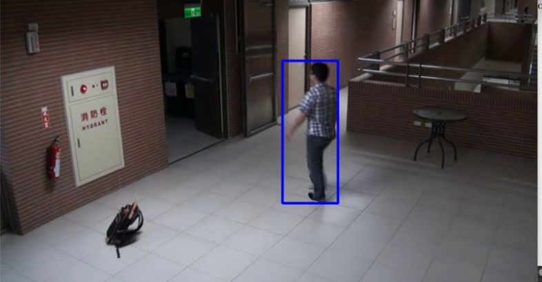
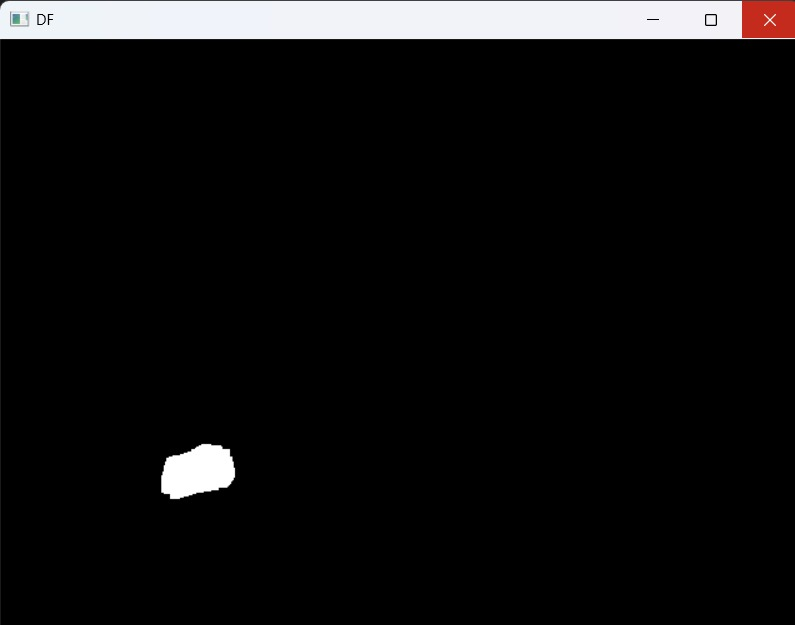
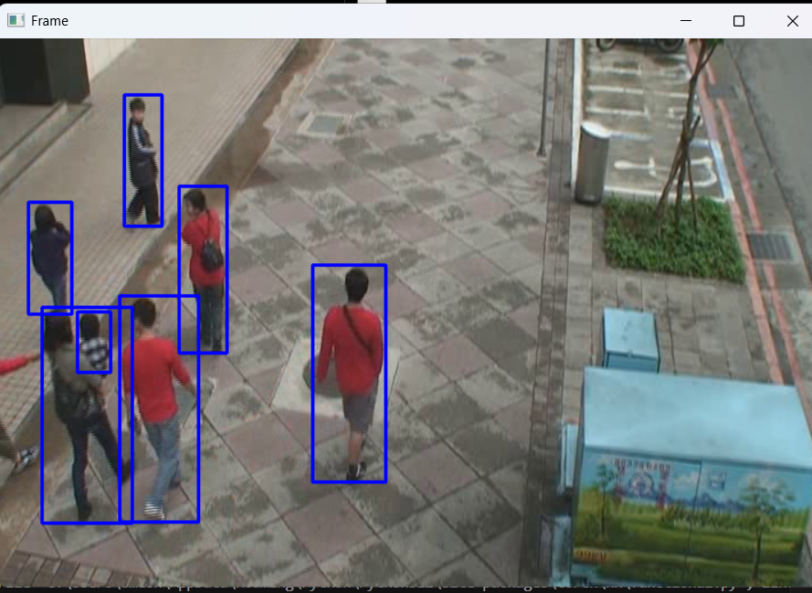
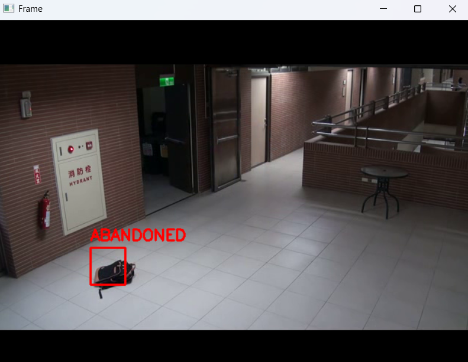
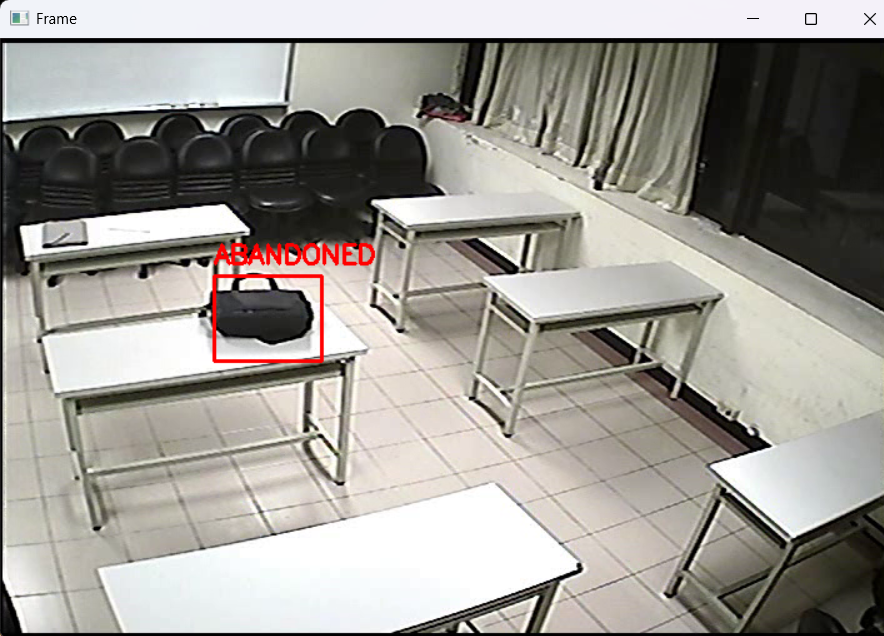
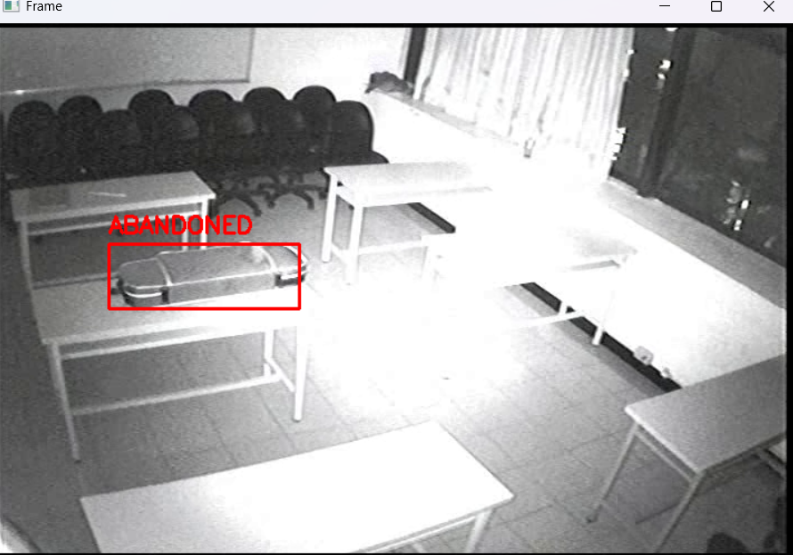

# Abandoned Object Detection Pipeline

This repository contains an **Abandoned Object Detection** system developed by **Group 327 (Umesh Kashyap – 2023UCS1693 and Yash Aggarwal – 2023UCS1698)**. The system detects unattended objects in surveillance videos using **dual background modeling** and **YOLO-based person detection**.

Unlike fully deep learning–based pipelines, this approach **avoids deep learning for background subtraction** and uses **YOLO only for human detection**, making it lightweight and suitable for real-time deployment.

---

## Overview

The proposed method combines:
- Dual background subtraction (short-term + long-term)
- Longest contour selection
- Hu invariant shape matching
- YOLO-based person detection
- Spatial human-object association
- Temporal abandonment reasoning
- Illumination change adaptation

---

## Pipeline Overview

Video Input → Dual Background Modeling → Foreground Extraction  
→ Longest Contour Selection → Shape Matching (Hu Invariants)  
→ YOLO Person Detection → Human-Object Distance Check  
→ Temporal Tracking → Abandonment Decision  

## Illumination Change Handling

The system also dynamically adjusts background learning rates when sudden illumination change is detected. This prevents background corruption and ensures stable foreground extraction.

---

## Example Results

### Frame


### Background Subtraction


### YOLO Human Detection



### Final Abandoned Object Detection





---

## Parameters

| Parameter | Value |
|-----------|-------|
| Abandonment time | 5 seconds |
| Minimum contour area | 500 |
| Short-term learning rate | 0.05 |
| Long-term learning rate | 0.0005 |
| Fast learning rate (illumination) | 0.5 |
| Illumination threshold | 0.3 |
| Owner Distance Threshold | 300 |
| Human detection | YOLOv11 |

---


## Dataset

Evaluation performed on **ABODA Dataset**, available in the repo in the ABODA folder, containing 11 videos

---

## How to Run

```bash
git clone https://github.com/umeshrl9/abandoned-object-detection.git
cd abandoned-object-detection
pip install opencv-python numpy ultralytics
python main.py
